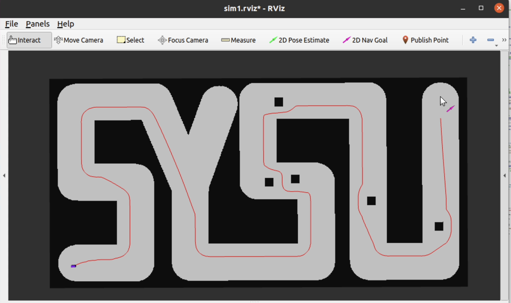

## 本项目是基于规划和汽车动力学的自动驾驶项目仿真

实现效果如下：



## 实现方案

### 规划

规划部分使用Dijkstra算法进行全局路径规划，DWA算法进行局部路径规划。

- 基于move_base实现

- 全局路径规划：Dijkstra算法

  该算法的基本思想是从起点开始，逐步扩展到其他节点，直到找到目标节点或者遍历完所有节点。通过维护一个距离表，记录从起点到每个节点的最短距离，以及一个前驱节点表，记录到达每个节点的最短路径中的前一个节点，算法不断更新这两个表的值，直到找到目标节点或者无法继续扩展。

- 局部路径规划：DWA算法

  DWA（Dynamic Window Approach）算法是一种用于机器人导航中的局部路径规划的算法。它是一种基于动态窗口的方法，用于在机器人当前状态下搜索最佳速度指令，以避免障碍物并达到目标位置。

  DWA算法的核心思想是根据机器人的动力学模型和环境信息，在速度-转向空间中搜索一个动态窗口，该窗口包含了机器人当前速度的一些可能变化范围。然后，通过评估每个速度指令的安全性和目标接近度，选择最佳速度指令作为机器人的下一步移动。

  该算法的实现步骤如下：

  1. 获取无人车当前状态，包括位置、速度和朝向。
  2. 在速度-转向空间中定义一个动态窗口，该窗口由无人车的最大速度和最大转向速度限制确定。
  3. 对于动态窗口中的每个速度指令，通过无人车的动力学模型预测无人车在给定时间内的轨迹。
  4. 对于每个轨迹，评估其与障碍物的安全距离，以及其与目标位置的距离。
  5. 根据评估结果，计算每个速度指令的得分，选择得分最高的速度指令作为无人车的下一步移动。
  6. 将选择的速度指令发送给无人车执行。

  该算法的优点是不需要将全局规划出的路径进行平滑，因为DWA规划出的局部路径符合车辆运动学，并且由于其实时规划的特性，可以实现实时避障。

  ==关于路径规划算法的参数设置参见`/src/simulation_launch/param`下的`.yaml`文件。==

### 控制

控制部分使用了双PID控制器，它的优点首先是比较容易实现，另外它能够更好地处理非线性和时变性系统，提高控制系统的稳定性和性能。

一个PID控制器的输出是油门大小，另一个PID控制器的输出是舵角大小。

```cpp
//—————————————————双PID控制器————————————————————//
// 定义PID控制器参数
// 油门
double throttle_Kp = 1.0;
double throttle_Ki = 0.0;
double throttle_Kd = 0.0;
// 舵角
double steering_Kp = 0.8;
double steering_Ki = 8.0;
double steering_Kd = 0.0;

// 双PID控制器的输出
double throttle_delta[2] = {0.}; // 油门变化量2维,{油门, 舵角};

// 定义双PID控制器
class PIDController {
private:
  double error; // 误差
  double integral; // 积分
  double derivative; // 微分
  double previous_error; // 上次误差

public:
  double Kp; // 比例系数
  double Ki; // 积分系数
  double Kd; // 微分系数

  // 构造函数
  PIDController(double kp, double ki, double kd) {
    Kp = kp; 
    Ki = ki;
    Kd = kd;
    error = 0.0;
    integral = 0.0;
    derivative = 0.0;
    previous_error = 0.0;
  }
  
  // 计算输出（油门，舵角）
  double calculate(double expectation, double measured, double dt) {
    error = expectation - measured;
    double output;

    integral += error ;
    derivative = (error - previous_error);
    output = Kp * error + Ki * integral + Kd * derivative;
    previous_error = error;
    return output;
  }
};

// 创建PID控制器对象
PIDController throttle_controller(throttle_Kp, throttle_Ki, throttle_Kd);
PIDController steering_controller(steering_Kp, steering_Ki, steering_Kd);
```

对于throttle_controller输入行驶方向速度，输出为油门大小。

对于steering_controller输入角速度，输出为舵角大小。

### Dynamic车辆动力学模型

根据给定车辆动力学模型进行状态更新

```cpp
//—————————————————状态更新函数————————————————————//
// 状态更新，输入参数为当前状态xC，油门变化throttle_delta，以及时间间隔dt
void update_xC(double* xC, double* throttle_delta, double dt) {
    
    // 定义车辆参数
    double Cm1 = 0.287;  // 前轮滑移力矩系数
    double Cm2 = 0.0545;  // 前轮滑移力矩系数
    double Cr0 = 0.0218;  // 轮胎滚动阻力系数
    double Cr2 = 0.00035;  // 轮胎滚动阻力系数
    double B_r = 3.3852;  // 后轮侧向力系数
    double C_r = 1.2691;  // 后轮侧向力系数
    double D_r = 0.1737;  // 后轮纵向力系数
    double B_f = 2.579;  // 前轮侧向力系数
    double C_f = 1.2;  // 前轮侧向力系数
    double D_f = 0.192;  // 前轮纵向力系数

    // 定义车辆质量和惯性矩
    double m = 0.041;  // 车辆质量
    double Iz = 27.8e-6;  // 车辆惯性矩
    double l_f = 0.029;  // 前轴到质心的距离
    double l_r = 0.033;  // 后轴到质心的距离
    double g = 9.8;  // 重力加速度

    // 计算前后轴负荷
    double Nf = m * g * l_r / (l_f + l_r);
    double Nr = m * g * l_f / (l_f + l_r);


    // 获取当前状态
    double phi = xC[2];  // 当前车辆的航向角
    double v_x = xC[3];  // 当前车辆的纵向速度
    double v_y = xC[4];  // 当前车辆的横向速度
    double omega = xC[5];  // 当前车辆的角速度
    double D = throttle_delta[0];  // 油门变化量
    double delta = throttle_delta[1];  // 方向盘转角

    // 计算前后轮侧偏角
    double alpha_f = std::atan2((l_f * omega + v_y), std::abs(v_x)) - delta;
    double alpha_r = std::atan2((v_y - l_r * omega), std::abs(v_x));

    // 计算前后轮侧向力和纵向力
    double F_fy = D_f * std::sin(C_f * std::atan(-B_f * alpha_f));
    double F_fx = -Cr0 * Nf - Cr2 * v_x * v_x;
    double F_ry = D_r * std::sin(C_r * std::atan(-B_r * alpha_r));
    double F_rx = (Cm1 * D - Cm2 * D * v_x - Cr0 * Nr - Cr2 * v_x * v_x);

    // 计算dx
    double dx[6] = {0.0};
    dx[0] = v_x * std::cos(phi) - v_y * std::sin(phi);
    dx[1] = v_y * std::cos(phi) + v_x * std::sin(phi); 
    dx[2] = omega;

    dx[3] = 1 / m * (F_rx + F_fx * std::cos(delta) - F_fy * std::sin(delta) + m * v_y * omega);
    dx[4] = 1 / m * (F_ry + F_fx * std::sin(delta) + F_fy * std::cos(delta) - m * v_x * omega); 
    dx[5] = 1 / Iz * (F_fx * std::sin(delta) * l_f + F_fy * l_f * std::cos(delta) - F_ry * l_r);

    //更新xC
    for (int i = 0; i < 6; i++) {xC[i] = xC[i] + dx[i]*dt ;}
    
    // 初始状态下限定位置和速度为0
    if(throttle_delta[0] == 0.0 && throttle_delta[1] == 0.0){xC[0] = 0.0;xC[3] = 0.0;}

    // 限制x轴方向速度
    if (xC[3] < min_vx && xC[3]!=0) {xC[3] = min_vx;}
    if (xC[3] > max_vx) {xC[3] = max_vx;}
    
    // 限制y轴方向速度
    xC[4] = 0.0;
    
    // 限制角速度
    if (xC[5] > max_vphi) {xC[5] = max_vphi;}
    if (xC[5] < min_vphi) {xC[5] = min_vphi;}
}
```

## 项目说明

将控制器集成到了主函数`vehicle_fake_node`中，并没有作为一个单独的节点。

环境要求：

- Ubuntu20.04.2
- ROS1 Noetic
- rviz
- map_server
- move_base
- amcl

项目运行：

1. 创建工作空间，打开终端

   ```
   mkdir -p ~/catkin_ws
   ```

2. 将src文件夹复制到该文件夹下

3. 编译软件包

   ```
   catkin_make
   ```

4. 设置环境变量

   ```
   source ./devel/setup.bash
   ```

5. 运行launch文件启动节点

   ```
   roslaunch simulation_launch move_base_simulation.launch
   ```

之后在打开的rviz可视化界面内用2D Pose Estimate和2D Nav Goal选择起点和终点就可以进行仿真了。